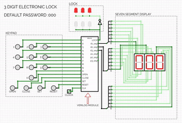

# electronic-locker
A minimal electronic locker accessible using an 3 digit password implemented using only logic gates from scratch as part of my 3rd semester project

Circuit Implementation :
The circuit was developed using 

